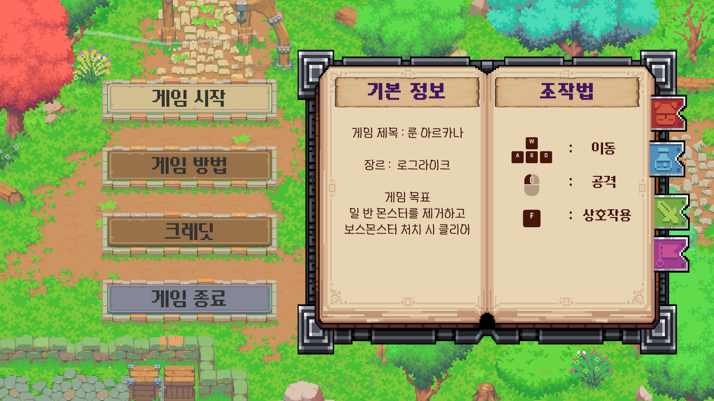
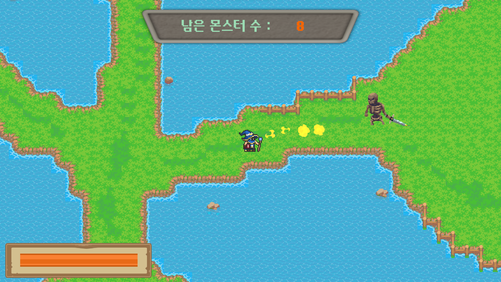
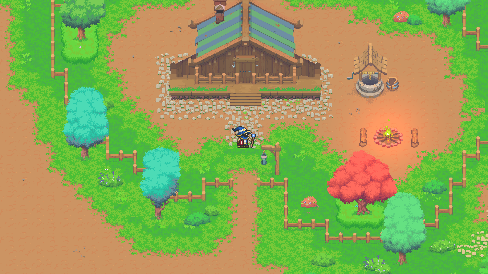

# Rune Arcana

탑다운 2D 액션 게임이다.  
마을에서 상호작용으로 스테이지에 진입하고, 스테이지를 탐색하며 전투를 진행한다.

---

## 개발 환경

- Engine: Unity 6.3.
- Input: New Input System.
- Platform: Windows.
- Genre: Top-Down Action.

---

## 게임 흐름

1. 타이틀 화면에서 게임을 시작한다.  
2. 마을에서 이동하며 오브젝트와 상호작용한다.  
3. 상호작용(F)으로 스테이지에 진입한다.  
4. 스테이지에서 이동 및 전투를 진행한다.

---

## 조작법

- 이동: WASD
- 공격: 마우스 좌클릭
- 상호작용: F
- 조준: 마우스 포인터 방향

---

## 구현 기능

### UI / 씬 전환

- 타이틀 UI 구성.
- 버튼 클릭 기반 씬 전환.
- 페이드 애니메이션을 활용한 전환 연출.

### 플레이어

- Rigidbody2D 기반 탑다운 이동.
- Idle / Move 애니메이션 적용.
- 마우스 조준 기반 투사체 발사(화염구).

### 투사체
- 발사 방향/속도 기반 이동.
- 수명(lifeTime) 기반 자동 파괴.
- 적 충돌 시 파괴 처리.
- 발사/충돌 사운드 재생.

### 몬스터
- 플레이어 추적 이동.
- 투사체 피격 시 HP 감소 및 사망 처리.
- 공격 범위/데미지 스탯 기반 처리.

### 환경/연출

- Sorting Layer 제어로 전경/후경 표현.
- Light2D 기반 캠프파이어 불빛 연출.

---

## 데이터 구조

- ScriptableObject 기반 스탯 데이터 분리.
  - PlayerStat: HP, Damage, MoveSpeed.
  - MonsterStat: HP, MoveSpeed, Attack_Range, Attack_Damage 등.

---

## 아키텍처 개요

이 프로젝트는 Title/Town/Stage 씬 흐름을 가진다.  
입력은 New Input System 기반으로 처리한다.  
전투는 PlayerController가 투사체를 생성하고, 투사체가 적과 충돌하면 적의 HP를 감소시키는 구조이다.  
씬 전환은 UI 애니메이션(페이드) 후 GameSceneManager가 처리한다.

---

## 클래스 참조 관계

### 핵심 매니저

- GameManager → GameSceneManager, SoundManager를 생성하고 DontDestroyOnLoad로 유지한다.
- GameSceneManager → 씬 로드/전환과 종료를 담당한다.
- SoundManager → UI/플레이어/몬스터에서 SFX 재생을 담당한다.

### UI/씬 전환

- TitleUIController → SoundManager를 사용해 UI 효과음을 재생한다.
- ChangeScene → GameSceneManager를 호출해 페이드 후 씬을 전환한다.
- BookDescription → 책 UI의 HowTo/Credits 토글 애니메이션을 담당한다.

### 월드 오브젝트(마을/환경)

- ObeliskController → PlayerController의 InteractInput을 읽고 ChangeScene으로 스테이지 진입을 트리거한다.
- BridgeController → TilemapCollider2D(강) 콜라이더를 On/Off 한다.
- PropsController → Player 위치에 따라 SpriteRenderer sortingLayerName을 변경한다.
- CampfireController → Light2D를 조절해 불빛 흔들림을 연출한다.

### 플레이어/전투

- PlayerController
  - Player_Actions(입력)과 Rigidbody2D(이동)를 사용한다.
  - PlayerSoundController로 발사/발걸음 사운드를 재생한다.
  - 공격 시 Fireball 프리팹을 Instantiate 한다.
  - StateMachine과 Idle/Move/Attack 상태를 가진다.
- FireballController
  - PlayerController의 방향/데미지를 참조해 이동과 피해량을 결정한다.
  - 적/보스 태그 충돌 시 일정 시간 후 파괴한다.

### 몬스터

- MonsterControlller
  - Player를 타겟으로 추적 이동한다.
  - Raycast로 플레이어를 판정하고 피해를 준다.
  - MonsterStat(ScriptableObject)로 스탯을 초기화한다.
  - MonsterSoundController로 피격/공격 사운드를 재생한다.
  - StateMachine과 Idle/Move/Attack/Hurt/Dead 상태를 가진다.

---

## 전투 흐름 요약

1. PlayerController가 Attack 입력을 받는다.
2. FireBall 코루틴에서 Fireball 프리팹을 생성한다.
3. FireballController가 방향 벡터로 linearVelocity를 적용한다.
4. Fireball이 적(Collider2D)과 충돌하면 몬스터 HP가 감소한다.
5. 몬스터 HP가 0 이하가 되면 사망 처리 후 제거한다.

---

## 데이터(ScriptableObject)

- PlayerStat: HP, Damage, MoveSpeed 등을 가진다.
- MonsterStat: HP, MoveSpeed, Attack_Range, Attack_Damage 등을 가진다.
- 스탯은 코드와 분리되어 Inspector에서 밸런싱한다.

---

## 폴더 구조

- Assets/Scripts/
  - Manager/
  - Player/
  - Monster/
  - UI/
  - Props/
  - Util/

---

## 트러블슈팅

- Animator가 루트 Transform을 커브로 제어하면 Rigidbody2D 이동이 무력화될 수 있다.  
  Root(물리)와 Visual(애니메이션)을 분리하는 방식이 안정적이다.
- LayerMask는 Raycast에 사용할 때 비트마스크 형태로 세팅해야 한다.  
  LayerMask.GetMask 또는 1 << layerIndex 형태로 사용한다.
- AudioSource/Clip이 누락되면 투사체 사운드에서 예외가 발생할 수 있다.  
  null 체크와 자동 컴포넌트 확보로 방어한다.

---

## 앞으로 개선할 점

- 방 단위 전투 트리거 및 문 잠금/해제 구현.
- 몬스터 공격 패턴 다양화 및 플레이어 피격/무적 시간 처리.
- 투사체/이펙트 Object Pool 적용.
- 게임 클리어/게임 오버 UI 정리.

---

## 실행 방법

1. Unity에서 프로젝트를 연다.
2. Build Settings에 씬을 등록한다.
3. Play 또는 Build 후 실행한다.

---